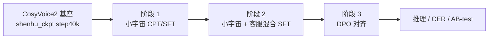

# CosyVoice 华为客服 SFT / DPO 训练

基于 [CosyVoice2-0.5B](https://github.com/FunAudioLLM/CosyVoice)（Qwen2 LLM + Causal Flow + HiFiGAN）的 **LLM 微调** 工程。本仓库在官方 CosyVoice 之上，围绕华为客服（申虎 / kefu）场景做了数据划分、流式 bi-stream 训练、DPO 偏好对齐与推理评测脚本。

**核心训练入口**：[`examples/huawei_sft/`](examples/huawei_sft/)

---

## 目录

- [整体训练流程](#整体训练流程)
- [环境准备](#环境准备)
- [数据说明](#数据说明)
- [阶段一：小宇宙全量 CPT / SFT](#阶段一小宇宙全量-cpt--sft)
- [阶段二：小宇宙 + 客服混合 SFT 复现](#阶段二小宇宙--客服混合-sft-复现)
- [阶段三：DPO 偏好对齐](#阶段三dpo-偏好对齐)
- [配置与关键超参](#配置与关键超参)
- [推理与评测](#推理与评测)
- [项目结构](#项目结构)
- [相关文档](#相关文档)

---

## 整体训练流程

训练仅更新 **LLM**（Flow / HiFiGAN 沿用预训练权重）。推荐按三阶段串行进行，前一阶段最优 checkpoint 作为下一阶段 `--checkpoint` 初始化。



| 阶段 | 目标 | 典型数据 | 入口脚本 |
|------|------|----------|----------|
| **1. 小宇宙 CPT** | 在通用播客语料上继续预训练 / SFT，学习自然口语韵律 | `xiaoyuzhou_f03_*` | `run_sft_xiaoyuzhou_f03_*.sh` |
| **2. 混合 SFT 复现** | 小宇宙 + 申虎客服数据混合，对齐客服话术与音色 | `xiaoyuzhou_shenhu_*` / `top500k_shenhu_*` | `run_sft_xiaoyuzhou_shenhu_*.sh` |
| **3. DPO** | 用 chosen/reject 语音 token 对做偏好优化 | `dpo_train.list` | `run_dpo_xiaoyuzhou_shenhu_*.sh` |

> **命名约定**：脚本名中的 `10-5` / `5-5` 表示 **小宇宙 : 申虎** 的数据混合比例；`f03` 表示 F03 说话人子集；`1e-6` / `1e-5` 为学习率；`_spk` 表示训练时使用 `<\|spk_1\|>` speaker token；`bigbatch_stream` / `bistream_5_10` 表示流式 bi-stream 训练配置。

---

## 环境准备

```bash
# 1. 依赖
pip install -r requirements.txt

# 2. 子模块（HiFiGAN / Matcha-TTS）
git submodule update --init --recursive

# 3. 预训练模型（CosyVoice2-0.5B）
# 需包含 CosyVoice-BlankEN（Qwen 骨干）、speech tokenizer ONNX、spk embedding ONNX 等
# 脚本中默认路径：pretrained_models/CosyVoice2-0.5B

# 4. 进入训练目录
cd examples/huawei_sft
source path.sh   # 设置 PYTHONPATH
```

**主要依赖**：PyTorch 2.3.1 + CUDA 12.1、`transformers`、`deepspeed`、`HyperPyYAML`、`wetext`（文本规范化）。

**客服场景 TN**（推理时建议开启）：

```bash
export COSYVOICE_CUSTOMER_SERVICE_TN=1
```

详见 [`docs/CUSTOMER_SERVICE_TN.md`](docs/CUSTOMER_SERVICE_TN.md)。

---

## 数据说明

### 数据清单位置

| 路径 | 说明 |
|------|------|
| [`data_list/splits/`](data_list/splits/) | 各阶段 `.lst` 清单及分片目录 |
| [`data_list/dpo/`](data_list/dpo/) | DPO 原始 pair 与中间产物 |
| [`data_list/dpo_process_filter/`](data_list/dpo_process_filter/) | DPO 筛选、Gemini 理解、格式转换 |

### 常见 `.lst` 文件

| 文件 | 用途 |
|------|------|
| `xiaoyuzhou_f03_10-5.lst` | 阶段 1：小宇宙 + F03，10:5 混合 |
| `xiaoyuzhou_shenhu_10-5.lst` | 阶段 2：小宇宙 + 申虎，10:5 混合 |
| `top500k_shenhu_10-5.lst` | 阶段 2：top500k 规模混合（非流式） |
| `top500k_shenhu_10-5_bistream.lst` | 阶段 2：流式 bi-stream 训练用混合集 |

`.lst` 每行指向一个 jsonl 分片或单个 jsonl；每行 jsonl 为一条训练样本，典型字段如下：

```json
{
  "utt": "46553",
  "wav_path": "/path/to/46553.wav",
  "text": "嗯，好的，感谢您先生……",
  "code": [3947, 6324, 4137, ...],
  "caption": "在结束对话的语境下……",
  "spkemb_path": "/path/to/46553.npy"
}
```

训练 loader 主要使用 `text` / `code`（speech token）及可选的 speaker embedding。

### DPO 数据格式

DPO 样本需包含 **chosen / rejected** 两套 speech token：

```json
{
  "key": "utt_id",
  "txt": "客服话术文本",
  "code": [123, 456, ...],
  "reject_code": [789, ...]
}
```

由 kefu pair 转换而来：

```bash
python data_list/dpo_process_filter/gemini_understanding/convert_kefu_pairs_to_cosy_dpo.py \
  --input_jsonl /path/to/kefu_dpo_pairs.jsonl \
  --out_dir /path/to/dpo_ready \
  --cv_ratio 0.02
```

输出 `dpo_train.list`、`dpo_cv.list` 及对应 jsonl。

---

## 阶段一：小宇宙全量 CPT / SFT

**目的**：在「小宇宙」播客语料（及 F03 子集）上对 LLM 做 continued pre-training / SFT，建立自然口语基础，再进入客服域。

```bash
cd examples/huawei_sft

# 单卡示例（可按需改 CUDA_VISIBLE_DEVICES）
export CUDA_VISIBLE_DEVICES=0
bash run_sft_xiaoyuzhou_f03_10-5_1e-6.sh
```

| 项 | 典型值 |
|----|--------|
| 初始 checkpoint | `shenhu_ckpt/epoch_0_step_40000.pt`（CosyVoice2 基座） |
| 训练数据 | `data_list/splits/xiaoyuzhou_f03_10-5.lst` |
| 验证数据 | 申虎 caption 测试集 list |
| 配置 | `conf/cosyvoice2_sft_1e-6.yaml` |
| 学习率 | `1e-6`（或 `1e-5`，见 `_1e-5` 脚本） |
| 输出目录 | `ckpt/huawei/cosyvoice2/sft_xiaoyuzhou_f03_10-5_1e-6` |

**并行 sweep**（8 路 lr × 数据比例组合）：

```bash
bash run_all_sft_8_parallel.sh
```

---

## 阶段二：小宇宙 + 客服混合 SFT 复现

**目的**：将阶段 1  checkpoint 作为初始化，在小宇宙与申虎（kefu）混合数据上 SFT，复现客服音色与话术风格。

### 基础混合训练

```bash
cd examples/huawei_sft
export CUDA_VISIBLE_DEVICES=0

# 10:5 混合，lr=1e-6
bash run_sft_xiaoyuzhou_shenhu_10-5_1e-6.sh
```

| 项 | 典型值 |
|----|--------|
| 初始 checkpoint | 阶段 1 的 `epoch_*_whole.pt` 或 step ckpt |
| 训练数据 | `data_list/splits/xiaoyuzhou_shenhu_10-5.lst` |
| 配置 | `conf/cosyvoice2_sft_1e-6.yaml` 或 `cosyvoice2_sft_1e-6_spk.yaml` |

### 流式 bi-stream 训练（推荐上线版本）

面向 **流式推理**（`inference_bistream`），固定 text:speech 块比例，避免训练时 50% 随机 mix：

```bash
# 8 卡 bigbatch + bistream
bash run_sft_xiaoyuzhou_shenhu_10-5_1e-6_bigbatch_stream.sh

# 4 卡，mix_ratio [5, 10]（text:speech）
bash run_sft_xiaoyuzhou_shenhu_10-5_1e-6_bigbatch_stream_4gpu_5_10.sh
```

可通过环境变量覆盖初始化 ckpt 与输出路径：

```bash
INIT_SFT_CKPT=/path/to/prev/epoch_5_whole.pt \
SFT_OUTPUT_DIR=/path/to/output \
TRAIN_BRANCH_MODE=bistream \
bash run_sft_xiaoyuzhou_shenhu_10-5_1e-6_bigbatch_stream.sh
```

**多 init-ckpt 顺序 sweep**（对比不同阶段 1 起点）：

```bash
bash run_all_sft_init_ckpt_seq_4gpu_bigbatch_stream_5_10.sh
```

### 一键：训练 → 推理 → CER 汇总

```bash
cd /path/to/CosyVoice
bash run_all_train_infer_summary_4gpu_bistream_5_10.sh

# 跳过训练，仅推理+汇总
RUN_TRAIN=0 bash run_all_train_infer_summary_4gpu_bistream_5_10.sh
```

---

## 阶段三：DPO 偏好对齐

**目的**：在 SFT 模型基础上，用客服场景的 chosen/reject 语音 token 对做 DPO，抑制坏韵律 / 读错 / 口语化不足等问题。

### 准备 DPO 数据

见 [DPO 数据格式](#dpo-数据格式)。脚本默认读取：

- 训练：`/home/node62_data/hkxie/data/dpo_ready/dpo_train_1000.list`
- 验证：`.../dpo_cv.list`

### 启动训练

```bash
cd examples/huawei_sft
export CUDA_VISIBLE_DEVICES=0,1,2,3

bash run_dpo_xiaoyuzhou_shenhu_10-5_1e-6_bigbatch_stream.sh
```

| 项 | 典型值 |
|----|--------|
| 初始 / ref model | 阶段 2 SFT checkpoint（policy 与 ref 同源） |
| 配置 | `conf/cosyvoice2_dpo_1e-6_spk.yaml` |
| 关键参数 | `--dpo --ref_model <same_ckpt>` |
| `train_branch_mode` | `bistream`（与 SFT 流式布局一致） |
| 输出 | `ckpt/huawei/cosyvoice2/dpo_xiaoyuzhou_shenhu_10-5_1e-6_bigbatch_stream` |

底层训练入口（`cosyvoice/bin/train.py`）在 `--dpo` 时会将 `forward` 切换为 `forward_dpo`。

---

## 配置与关键超参

配置文件位于 [`examples/huawei_sft/conf/`](examples/huawei_sft/conf/)。

| 配置 | 说明 |
|------|------|
| `cosyvoice2_sft_1e-6.yaml` | 基础 SFT，lr=1e-6，`mix_ratio: [5, 15]` |
| `cosyvoice2_sft_1e-6_spk.yaml` | 带 `<\|spk_1\|>`，`train_branch_mode: auto` |
| `cosyvoice2_sft_1e-6_spk_bistream_5_10.yaml` | 流式 bi-stream，`mix_ratio: [5, 10]` |
| `cosyvoice2_dpo_1e-6_spk.yaml` | DPO 专用，默认 `train_branch_mode: bistream` |

**`train_branch_mode` 含义**（`train.py --train_branch_mode`）：

| 模式 | 行为 |
|------|------|
| `auto` | 满足 ratio 时 50% 概率走 bi-stream |
| `bistream` | 始终按 `mix_ratio` 块交错 text / speech token |
| `unistream` | 整句单流序列（DPO forward 默认逻辑） |

**流式推理对齐**：训练用 `bistream` + `mix_ratio [5,10]` 时，推理使用 `infer_seed.py --bistream_fixed_ratio`（固定每块 5 个 text token）。

---

## 推理与评测

### 单条 / 批量推理

```bash
# 根目录 infer_seed.py — 支持 SFT spk、流式 bi-stream、分片并行
python infer_seed.py \
  --model_dir /path/to/CosyVoice2-0.5B \
  --llm_ckpt /path/to/epoch_N_whole.pt \
  --meta_file /path/to/test.lst \
  --output_dir /path/to/wavs \
  --bistream_fixed_ratio
```

`meta.lst` 格式：`id|prompt_text|prompt_wav_path|tts_text`

### Checkpoint sweep

```bash
# 多 epoch 批量推理 + TOP_N 筛选
RUN_MODE=parallel GPU_LIST=0,1,2,3 IS_SFT=1 TOP_N=5 \
SFT_SPK_ID="中文女" META_FILE=/path/to/kefu_test.lst \
bash infer_shenhu_sft_ckpt_sweep_onlyshenhu_dpo_tn_0526_bistream.sh
```

### AB-test 盲测打包

见 [`data_list/AB-test/README.md`](data_list/AB-test/README.md)。

---

## 项目结构

```
CosyVoice/
├── cosyvoice/                  # 核心库（LLM / Flow / HiFiGAN / dataset / bin/train.py）
├── examples/huawei_sft/        # ★ 华为训练主目录（conf / run_*.sh / exp / tensorboard）
├── data_list/                  # 数据清单、splits、DPO 处理脚本
├── docs/                       # 客服 TN 等说明
├── infer_seed.py               # 主推理脚本（流式 bi-stream）
├── run_all_train_infer_summary_4gpu_bistream_5_10.sh  # 训练+推理+汇总流水线
├── CLAUDE.md                   # 代码库架构说明（供 AI / 开发者参考）
└── requirements.txt
```

### 推理流水线（概念）

```
Text → Frontend (TN + tokenize) → LLM (speech tokens) → Flow (mel) → HiFiGAN (waveform)
```

- **v2 模型**：`Qwen2LM` + `CausalMaskedDiffWithXvec` + `HiFTGenerator`
- **仅训练 LLM**：Flow / HiFiGAN 权重来自 `pretrained_models/CosyVoice2-0.5B`

更完整的模块说明见 [`CLAUDE.md`](CLAUDE.md)。

---

## 相关文档

| 文档 | 内容 |
|------|------|
| [`CLAUDE.md`](CLAUDE.md) | CosyVoice 架构、训练/推理命令、模块索引 |
| [`docs/CUSTOMER_SERVICE_TN.md`](docs/CUSTOMER_SERVICE_TN.md) | 客服场景预文本规范化（号码、带宽等读法） |
| [`data_list/AB-test/README.md`](data_list/AB-test/README.md) | 模型 AB 盲测 wav 打包 |
| [`examples/huawei_sft/OPD_DISTILL.md`](examples/huawei_sft/OPD_DISTILL.md) | OPD / OPSD 蒸馏实验（扩展方向，非三阶段主流程） |

---

## 常见问题

**Q: 训练报 NCCL 错误？**  
脚本中已设置 `NCCL_P2P_DISABLE=1`、`NCCL_IB_DISABLE=1`；单机多卡请检查 `CUDA_VISIBLE_DEVICES` 与 `torchrun --nproc_per_node` 一致。

**Q: 阶段 2 必须接阶段 1 吗？**  
推荐串行。也可从 `shenhu_ckpt/epoch_0_step_40000.pt` 直接混合 SFT，但口语自然度通常不如先过小宇宙。

**Q: DPO 数据量很小（如 1000 条）是否有效？**  
当前脚本支持小规模 DPO；需保证 chosen/reject token 质量，并配合 cv set 监控过拟合。

**Q: `.codex` / `.claude` 目录？**  
为 Cursor / Claude Code 本地 IDE 配置目录；项目级开发约定以 [`CLAUDE.md`](CLAUDE.md) 为准。
